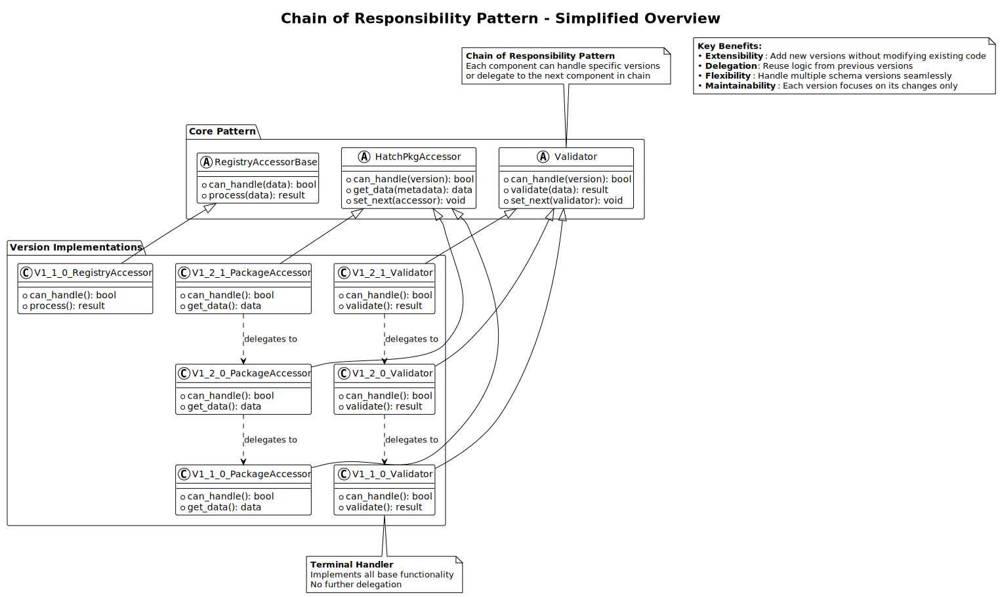
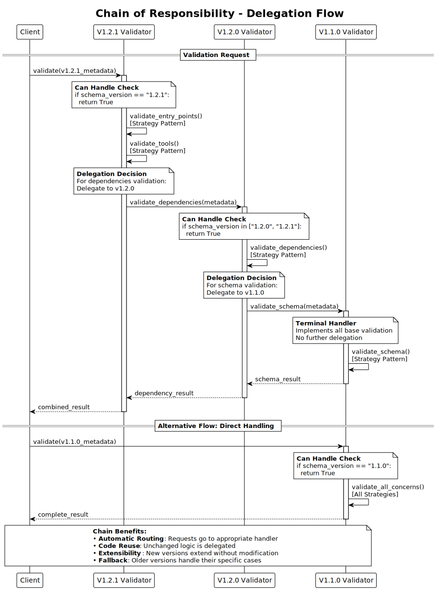
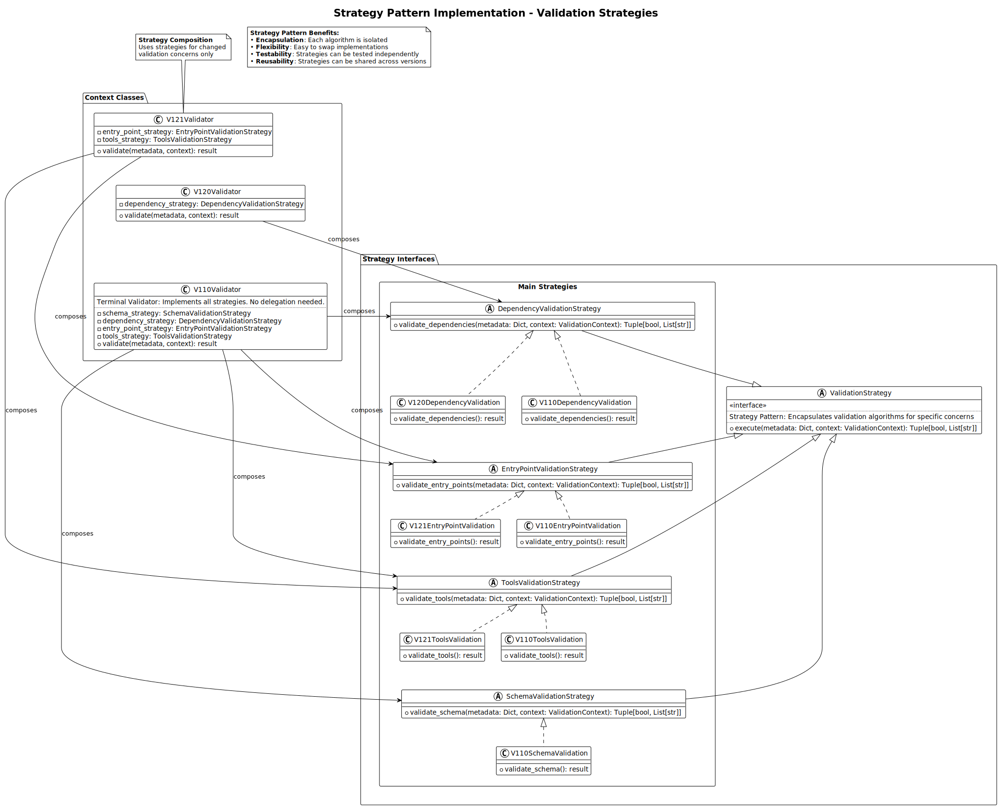

# Chain of Responsibility Pattern

This article is about:

- Chain of Responsibility pattern overview and principles in Hatch-Validator
- Strategy Pattern integration within validators for validation algorithm encapsulation
- Universal implementation pattern across validators, package accessors, and registry accessors
- Delegation mechanisms and chain construction across all component types
- Dual pattern architecture: when to use delegation vs. strategy composition
- Benefits for extensibility and maintainability in schema evolution

## Pattern Overview

The Chain of Responsibility pattern is the central architectural feature of Hatch-Validator, implemented consistently across three major component types. This pattern enables extensible functionality by allowing new components to inherit and modify only the changed logic from previous versions, creating a maintainable and scalable system.



*The diagram above shows the simplified Chain of Responsibility pattern structure across all three component types: Validators, Package Accessors, and Registry Accessors.*

### Core Principles

**Delegation Over Inheritance**: Components delegate unchanged concerns to previous versions rather than using traditional class inheritance.

**Version-Specific Specialization**: Each component version implements only the logic that has changed from previous versions.

**Automatic Chain Construction**: Factory classes automatically discover and link components from newest to oldest versions.

**Unified Interface**: All components in a chain provide the same interface to consumers, abstracting version differences.

## Dual Pattern Architecture

Validators implement a sophisticated dual-pattern architecture that combines Chain of Responsibility with Strategy Pattern to handle both version delegation and validation algorithm encapsulation.

### Pattern Integration

**Chain of Responsibility**: Handles version-specific delegation between validators for unchanged validation concerns.

**Strategy Pattern**: Encapsulates validation algorithms within each validator for changed validation concerns.

**Decision Matrix**: Each validation concern (schema, dependencies, entry points, tools) uses either strategy composition or chain delegation based on whether the validation logic has changed in the current version.

### When Validators Use Strategy Pattern

Validators compose strategies for validation concerns that have changed in their version:

- **New validation requirements**: Schema version introduces new validation logic
- **Algorithm changes**: Validation algorithm changes significantly from previous version
- **Version-specific logic**: New validation requirements specific to the current version

### When Validators Use Chain of Responsibility

Validators delegate to the chain for validation concerns that remain unchanged:

- **Unchanged logic**: Validation logic identical to previous version
- **No new requirements**: No new validation requirements introduced
- **Previous implementation sufficient**: Previous version's strategy meets current needs



*The diagram above shows the detailed delegation flow through the validator chain, demonstrating how components check if they can handle a request and delegate to the next component when needed.*

## Universal Implementation Pattern

### Three Component Types

The Chain of Responsibility pattern is implemented identically across three component types:

**1. Validators** (`hatch_validator/core/validator_base.py`)

- Handle validation logic for different schema versions
- Delegate unchanged validation concerns to previous validators

**2. Package Accessors** (`hatch_validator/core/pkg_accessor_base.py`)

- Provide unified access to package metadata across schema versions
- Delegate unchanged metadata access to previous accessors

**3. Registry Accessors** (`hatch_validator/registry/registry_accessor_base.py`)

- Enable consistent registry data access regardless of registry schema version
- Delegate unchanged registry operations to previous accessors

### Abstract Base Classes

All component types follow the same abstract base class pattern (replace `ComponentBase` with the actual base class name for each component type)

```python
# Universal pattern implemented by all three component types
class ComponentBase(ABC):
    def __init__(self, next_component: Optional['ComponentBase'] = None):
        self.next_component = next_component
    
    @abstractmethod
    def can_handle(self, version_or_data) -> bool:
        """Determine if this component can handle the given version/data."""
        pass
    
    def set_next(self, component: 'ComponentBase') -> 'ComponentBase':
        """Set the next component in the chain."""
        self.next_component = component
        return component
    
    # Delegation methods follow the same pattern:
    def operation(self, data):
        """Perform operation or delegate to next component."""
        if self.next_component:
            return self.next_component.operation(data)
        raise NotImplementedError("Operation not implemented for this version")
```

### Factory Pattern Integration

All component types use identical factory patterns for chain construction (replace `ComponentFactory` and `ComponentBase` with the actual factory and base class names for each component type)

```python
# Universal factory pattern used by all three component types
class ComponentFactory:
    _component_registry: Dict[str, Type[ComponentBase]] = {}
    _version_order: List[str] = []  # Newest to oldest
    
    @classmethod
    def create_component_chain(cls, target_version: Optional[str] = None) -> ComponentBase:
        """Create component chain from target version to oldest."""
        
        # Determine target version (latest if not specified)
        if target_version is None:
            target_version = cls._version_order[0]
        
        # Create chain starting from target version down to oldest
        target_index = cls._version_order.index(target_version)
        chain_versions = cls._version_order[target_index:]
        
        # Create components in order (newest to oldest)
        components = []
        for version in chain_versions:
            component_class = cls._component_registry[version]
            component = component_class()
            components.append(component)
        
        # Link components (each points to the next older one)
        for i in range(len(components) - 1):
            components[i].set_next(components[i + 1])
        
        return components[0]  # Return head of chain
```

## Delegation Mechanisms

### Version-Specific Delegation

Each component type implements delegation for unchanged concerns:

**Package Accessors Example:**

```python
class V121PackageAccessor(HatchPkgAccessorBase):
    """v1.2.1 accessor - handles dual entry points, delegates dependencies."""
    
    def get_entry_points(self, metadata: Dict[str, Any]) -> Dict[str, Any]:
        """Handle dual entry point access for v1.2.1."""
        # v1.2.1-specific logic for dual entry points
        return {
            'mcp_server': metadata.get('mcp_server', {}),
            'hatch_mcp_server': metadata.get('hatch_mcp_server', {})
        }
    
    def get_dependencies(self, metadata: Dict[str, Any]) -> Dict[str, Any]:
        """Delegate dependency access to v1.2.0."""
        if self.next_accessor:
            return self.next_accessor.get_dependencies(metadata)
        raise NotImplementedError("Dependencies accessor not implemented")

class V120PackageAccessor(HatchPkgAccessorBase):
    """v1.2.0 accessor - handles unified dependencies, delegates basic fields."""
    
    def get_dependencies(self, metadata: Dict[str, Any]) -> Dict[str, Any]:
        """Handle unified dependency structure for v1.2.0."""
        # v1.2.0-specific logic for unified dependencies
        return metadata.get('dependencies', {})
    
    def get_name(self, metadata: Dict[str, Any]) -> str:
        """Delegate basic field access to v1.1.0."""
        if self.next_accessor:
            return self.next_accessor.get_name(metadata)
        raise NotImplementedError("Name accessor not implemented")
```

### Delegation Flow

For a v1.2.1 package requesting dependencies:

1. **v1.2.1 Accessor**: Recognizes it doesn't handle dependencies → delegates to v1.2.0
2. **v1.2.0 Accessor**: Handles unified dependency structure → returns result
3. **Consumer**: Receives unified dependency data

For a v1.2.1 package requesting entry points:

1. **v1.2.1 Accessor**: Handles dual entry point logic → returns result directly
2. **Consumer**: Receives dual entry point data

### Terminal Components

The oldest version in each chain serves as the terminal component:

**v1.1.0 Components**: Implement all basic functionality without delegation

- **Package Accessor**: Handles all basic metadata fields and separate dependencies
- **Validator**: Implements all basic validation strategies
- **Registry Accessor**: Handles basic registry operations

## Chain Construction Process

### Automatic Discovery

Factory classes automatically discover available components:

```python
class ValidatorFactory:
    @classmethod
    def _ensure_validators_loaded(cls) -> None:
        """Automatically discover and register validators."""
        if not cls._validator_registry:
            # Import and register v1.2.1 validator (newest first)
            from hatch_validator.package.v1_2_1.validator import Validator as V121Validator
            cls.register_validator('1.2.1', V121Validator)
            
            # Import and register v1.2.0 validator
            from hatch_validator.package.v1_2_0.validator import Validator as V120Validator
            cls.register_validator('1.2.0', V120Validator)
            
            # Import and register v1.1.0 validator
            from hatch_validator.package.v1_1_0.validator import Validator as V110Validator
            cls.register_validator('1.1.0', V110Validator)
```

### Version Ordering

Components are ordered from newest to oldest:

```python
# Version order maintained across all component types
_version_order = ['1.2.1', '1.2.0', '1.1.0']  # Newest to oldest
```

### Chain Linking

Components are linked in a specific order:

1. **Create Components**: Instantiate all components in the chain
2. **Link Forward**: Each component points to the next older version
3. **Return Head**: Return the newest component as the chain head

```python
# Example chain for v1.2.1 target:
# v1.2.1 → v1.2.0 → v1.1.0
components[0].set_next(components[1])  # v1.2.1 → v1.2.0
components[1].set_next(components[2])  # v1.2.0 → v1.1.0
# v1.1.0 has no next (terminal)
```

## Strategy Pattern Integration

Validators implement the Strategy Pattern alongside Chain of Responsibility to encapsulate validation algorithms. This dual-pattern architecture provides fine-grained control over which validation concerns use strategy composition versus chain delegation.



*The diagram above shows how validation strategies are organized and implemented within the validator architecture, demonstrating the interface hierarchy and concrete strategy implementations.*

### Strategy Interface Hierarchy

Located in `hatch_validator/core/validation_strategy.py`:

```python
class ValidationStrategy(ABC):
    """Base interface for all validation strategies."""
    pass

class DependencyValidationStrategy(ValidationStrategy):
    @abstractmethod
    def validate_dependencies(self, metadata: Dict, context: ValidationContext) -> Tuple[bool, List[str]]:
        pass

class ToolsValidationStrategy(ValidationStrategy):
    @abstractmethod
    def validate_tools(self, metadata: Dict, context: ValidationContext) -> Tuple[bool, List[str]]:
        pass

class EntryPointValidationStrategy(ValidationStrategy):
    @abstractmethod
    def validate_entry_point(self, metadata: Dict, context: ValidationContext) -> Tuple[bool, List[str]]:
        pass

class SchemaValidationStrategy(ValidationStrategy):
    @abstractmethod
    def validate_schema(self, metadata: Dict, context: ValidationContext) -> Tuple[bool, List[str]]:
        pass
```

### Validator Strategy Composition

Each validator composes only the strategies for validation concerns that have changed in their version:

```python
class Validator(ValidatorBase):
    def __init__(self, next_validator=None):
        super().__init__(next_validator)
        # Compose strategies for changed concerns only
        self.schema_strategy = SchemaValidation()
        self.entry_point_strategy = EntryPointValidation()
        self.tools_strategy = ToolsValidation()
        # No dependency_strategy - delegates to v1.2.0
```

### Strategy vs. Chain Decision Matrix

**Strategy Composition Used When**:

- Schema version introduces new validation logic
- Validation algorithm changes significantly
- New validation requirements specific to version

**Chain Delegation Used When**:

- Validation logic unchanged from previous version
- No new validation requirements
- Previous version's strategy sufficient

### Version-Specific Strategy Implementation

**v1.2.1 Validator**:

- **Strategies**: `SchemaValidation`, `EntryPointValidation`, `ToolsValidation`
- **Delegation**: Dependencies → v1.2.0
- **Specialization**: Dual entry point validation, FastMCP server enforcement

**v1.2.0 Validator**:

- **Strategies**: `SchemaValidation`, `DependencyValidation`
- **Delegation**: Entry points, tools → v1.1.0
- **Specialization**: Unified dependency structure validation

**v1.1.0 Validator**:

- **Strategies**: All strategies (`SchemaValidation`, `DependencyValidation`, `EntryPointValidation`, `ToolsValidation`)
- **Delegation**: None (terminal validator)
- **Specialization**: Complete validation implementation

## Benefits for Extensibility

### Adding New Schema Versions

To add support for a new schema version (e.g., v1.3.0):

1. **Create Version Directory**: `hatch_validator/package/v1_3_0/`
2. **Implement Components**: Create accessor.py and validator.py
3. **Override Changed Logic**: Implement only methods that handle new features
4. **Delegate Unchanged Logic**: Use delegation for unchanged concerns
5. **Auto-Registration**: Factory automatically discovers new components

**Example v1.3.0 Accessor:**

```python
class V130PackageAccessor(HatchPkgAccessorBase):
    """v1.3.0 accessor - handles new features, delegates unchanged concerns."""
    
    def can_handle(self, schema_version: str) -> bool:
        return schema_version == "1.3.0"
    
    def get_new_feature(self, metadata: Dict[str, Any]) -> Any:
        """Handle v1.3.0-specific new feature."""
        return metadata.get('new_feature', {})
    
    # All others are automatically delegated from HatchPkgAccessorBase implementation
```

### Incremental Development

New versions require minimal code changes:

- **Focused Implementation**: Only implement changed functionality
- **Reuse Existing Logic**: Delegate unchanged concerns to previous versions
- **Isolated Testing**: Test only new functionality, existing logic is preserved
- **Gradual Migration**: Packages can migrate to new versions incrementally

## Benefits for Maintainability

### Code Reuse

The pattern maximizes code reuse across versions:

- **Delegation**: Unchanged logic is reused through delegation
- **No Duplication**: Avoid copying code between versions
- **Single Source of Truth**: Each piece of logic exists in one place

### Isolated Changes

Changes are isolated to specific versions:

- **Version Boundaries**: Changes are contained within version-specific modules
- **Minimal Impact**: New versions don't affect existing version logic
- **Safe Evolution**: Schema evolution doesn't break existing functionality

### Testability

The pattern improves testability:

- **Component Isolation**: Each component can be tested independently
- **Chain Testing**: Entire chains can be tested for delegation behavior
- **Version-Specific Testing**: Test only the logic specific to each version

## Error Handling in Chains

### Graceful Degradation

Chains handle errors gracefully:

```python
def operation(self, data):
    """Operation with graceful error handling."""
    try:
        # Try to handle with this component
        if self.can_handle(data):
            return self._handle_operation(data)
    except Exception as e:
        logger.warning(f"Component {self.__class__.__name__} failed: {e}")
    
    # Delegate to next component
    if self.next_component:
        return self.next_component.operation(data)
    
    # No component could handle the operation
    raise NotImplementedError(f"No component can handle operation for {data}")
```

### Chain Validation

Factories validate chain integrity:

- **Complete Coverage**: Ensure all supported versions have components
- **Proper Linking**: Verify components are linked correctly
- **Terminal Validation**: Confirm terminal components implement all operations

## Performance Considerations

### Lazy Loading

Components are created only when needed:

- **Factory Caching**: Factories cache created chains
- **On-Demand Creation**: Chains created only when requested
- **Component Reuse**: Same component instances used across operations

### Delegation Efficiency

Delegation is optimized for common cases:

- **Early Termination**: Delegation stops at first capable component
- **Version Ordering**: Most common versions are checked first
- **Minimal Overhead**: Delegation adds minimal performance cost

## Related Documentation

- [Component Types](ComponentTypes.md) - How different component types work together
- [Schema Integration](SchemaIntegration.md) - Integration with schema management
- [Extending Chain of Responsibility](../contribution_guidelines/ExtendingChainOfResponsibility.md) - Adding new components
