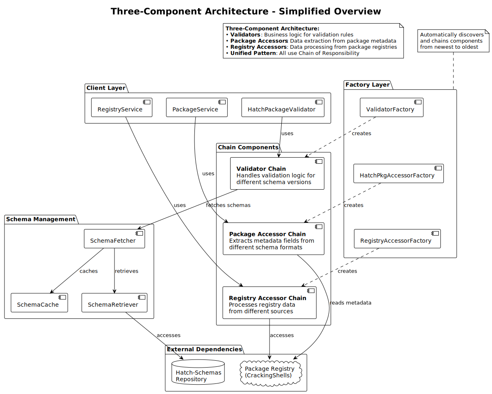
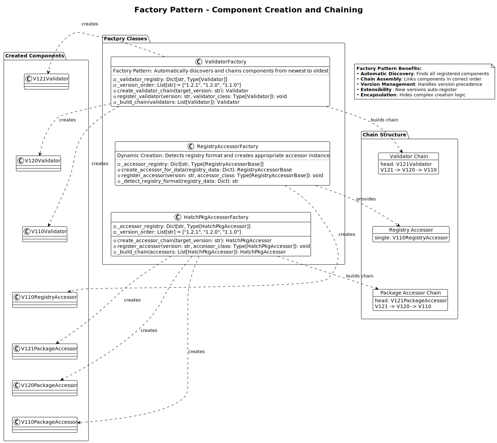

# Component Types

This article is about:

- Validators: Extensible validation with version-specific delegation
- Package Accessors: Version-agnostic metadata access capabilities
- Registry Accessors: Version-agnostic registry data access functionality
- How all three component types work together in the unified architecture

## Overview

Hatch-Validator implements the Chain of Responsibility pattern across three distinct component types, each serving a specific purpose in the validation and data access ecosystem. These components work together to provide comprehensive, version-agnostic functionality for package management and validation.



*The diagram above shows the three-component architecture with unified Chain of Responsibility patterns across Validators, Package Accessors, and Registry Accessors.*

## Validators

### Purpose and Scope

Validators handle validation logic for different schema versions, implementing comprehensive package validation while delegating unchanged validation concerns to previous validators in the chain.

**Location**: `hatch_validator/core/validator_base.py` and version-specific implementations

**Key Responsibilities:**

- Schema-specific validation logic
- Entry point validation
- Tools configuration validation
- Dependency structure validation
- Metadata schema validation

### Purpose and Scope
Validators implement a dual-pattern architecture combining Chain of Responsibility for version delegation with Strategy Pattern for validation algorithm encapsulation.

### Dual Pattern Implementation

**Strategy Composition**: Each validator composes strategies for validation concerns that have changed in their version

**Chain Delegation**: Validators delegate unchanged validation concerns to previous validators

### Version-Specific Strategy Implementation

**v1.2.1 Validator**:

- **Strategies**: SchemaValidation, EntryPointValidation, ToolsValidation
- **Delegation**: Dependencies → v1.2.0
- **Specialization**: Dual entry point validation (mcp_server + hatch_mcp_server)

**v1.2.0 Validator**:

- **Strategies**: SchemaValidation, DependencyValidation
- **Delegation**: Entry points, tools → v1.1.0
- **Specialization**: Unified dependency structure validation

**v1.1.0 Validator**:

- **Strategies**: All strategies (SchemaValidation, DependencyValidation, EntryPointValidation, ToolsValidation)
- **Delegation**: None (terminal validator)
- **Specialization**: Complete validation implementation

For detailed information on the dual pattern architecture, see [Chain of Responsibility Pattern](../architecture/ChainOfResponsibilityPattern.md#dual-pattern-architecture).

## Package Accessors

### Purpose and Scope

Package Accessors provide unified access to package metadata across schema versions, abstracting differences in metadata structure and field organization.

**Location**: `hatch_validator/core/pkg_accessor_base.py` and version-specific implementations

**Key Responsibilities:**

- Version-agnostic metadata field access
- Dependency structure normalization
- Entry point configuration access
- Tools configuration access
- Local dependency detection

### Package Accessor Architecture

**Base Class**: `HatchPkgAccessor` (abstract base class)

```python
class HatchPkgAccessor(ABC):
    def __init__(self, next_accessor: Optional['HatchPkgAccessor'] = None):
        self.next_accessor = next_accessor
    
    @abstractmethod
    def can_handle(self, schema_version: str) -> bool:
        """Determine if this accessor can handle the schema version."""
        pass
    
    def get_dependencies(self, metadata: Dict[str, Any]) -> Dict[str, Any]:
        """Get dependencies or delegate to next accessor."""
        if self.next_accessor:
            return self.next_accessor.get_dependencies(metadata)
        raise NotImplementedError("Dependencies accessor not implemented")

    # And so on for all other metadata access methods
```

### Version-Specific Implementations

**v1.2.1 Accessor** (`hatch_validator/package/v1_2_1/accessor.py`):

- **Specialization**: Dual entry point metadata access
- **Delegation**: Delegates dependency access to v1.2.0
- **Entry Points**: Handles both mcp_server and hatch_mcp_server configurations

**v1.2.0 Accessor** (`hatch_validator/package/v1_2_0/accessor.py`):

- **Specialization**: Unified dependency structure access
- **Delegation**: Delegates basic field access to v1.1.0
- **Dependencies**: Handles unified dependencies with hatch, python, system, docker types

**v1.1.0 Accessor** (`hatch_validator/package/v1_1_0/accessor.py`):

- **Specialization**: Terminal accessor implementing all basic metadata access
- **Dependencies**: Handles separate hatch_dependencies and python_dependencies
- **Coverage**: All basic metadata fields (name, version, description, etc.)

For delegation mechanisms, see [Chain of Responsibility Pattern](../architecture/ChainOfResponsibilityPattern.md#delegation-mechanisms).

## Registry Accessors

### Purpose and Scope

Registry Accessors enable consistent registry data access regardless of registry schema version, providing unified interfaces for package discovery and version resolution.

**Location**: `hatch_validator/registry/registry_accessor_base.py` and version-specific implementations

**Key Responsibilities:**

- Version-agnostic registry data access
- Package existence validation
- Version compatibility checking
- Package URI resolution
- Repository management operations

### Registry Accessor Architecture

**Base Class**: `RegistryAccessorBase` (abstract base class)

```python
class RegistryAccessorBase(ABC):
    def __init__(self, successor: Optional['RegistryAccessorBase'] = None):
        self._successor = successor
    
    @abstractmethod
    def can_handle(self, registry_data: Dict[str, Any]) -> bool:
        """Check if this accessor can handle the registry data."""
        pass
    
    def handle_request(self, registry_data: Dict[str, Any]) -> Optional['RegistryAccessorBase']:
        """Handle request using chain of responsibility pattern."""
        if self.can_handle(registry_data):
            return self
        elif self._successor:
            return self._successor.handle_request(registry_data)
        return None
```

### Version-Specific Implementations

**v1.1.0 Registry Accessor** (`hatch_validator/registry/v1_1_0/registry_accessor.py`):

- **Specialization**: CrackingShells Package Registry format
- **Coverage**: Repository-based structure with packages containing versions
- **Operations**: Package existence, version resolution, URI generation
- **Terminal**: Currently serves as terminal accessor for registry operations

Registry accessors use the same delegation pattern described in [delegation mechanisms](../architecture/ChainOfResponsibilityPattern.md#delegation-mechanisms).

## Component Integration

### Service Layer Integration

The three component types integrate through high-level service classes:

**PackageService Integration:**

```python
class PackageService:
    def __init__(self, metadata: Optional[Dict[str, Any]] = None):
        self._accessor: Optional[HatchPkgAccessor] = None
        if metadata:
            # Create package accessor chain
            schema_version = metadata.get("package_schema_version")
            self._accessor = HatchPkgAccessorFactory.create_accessor_chain(schema_version)
    
    def get_dependencies(self) -> Dict[str, Any]:
        """Use accessor chain for version-agnostic dependency access."""
        return self._accessor.get_dependencies(self._metadata)
```

**RegistryService Integration:**

```python
class RegistryService:
    def __init__(self, registry_data: Optional[Dict[str, Any]] = None):
        self._accessor: Optional[RegistryAccessorBase] = None
        if registry_data:
            # Create registry accessor chain
            self._accessor = RegistryAccessorFactory.create_accessor_for_data(registry_data)
    
    def package_exists(self, package_name: str) -> bool:
        """Use accessor chain for version-agnostic registry operations."""
        return self._accessor.package_exists(self._registry_data, package_name)
```

**HatchPackageValidator Integration:**

```python
class HatchPackageValidator:
    def validate_package(self, package_path: Path) -> Tuple[bool, Dict[str, Any]]:
        """Use validator chain for version-agnostic validation."""
        
        # Load metadata and detect schema version
        with open(package_path / "hatch_metadata.json", 'r') as f:
            metadata = json.load(f)
        
        schema_version = metadata.get("package_schema_version")
        
        # Create validator chain
        validator = ValidatorFactory.create_validator_chain(schema_version)
        
        # Execute validation through chain
        context = ValidationContext(registry_data=self.registry_data)
        is_valid, errors = validator.validate(metadata, context)
        
        return is_valid, self._format_results(is_valid, errors, metadata)
```

### Cross-Component Coordination

Components coordinate to provide comprehensive functionality:

**Validation with Data Access:**

```python
# Validator uses package accessor for dependency validation
class DependencyValidation:
    def validate(self, metadata: Dict, context: ValidationContext) -> Tuple[bool, List[str]]:
        # Use package accessor for version-agnostic dependency access
        package_service = PackageService(metadata)
        dependencies = package_service.get_dependencies()
        
        # Use registry accessor for dependency existence validation
        registry_service = RegistryService(context.registry_data)
        
        errors = []
        for dep_type, deps in dependencies.items():
            for dep in deps:
                if not registry_service.package_exists(dep['name']):
                    errors.append(f"Dependency {dep['name']} not found in registry")
        
        return len(errors) == 0, errors
```

### Factory Coordination

Factory classes coordinate component creation:



*The diagram above shows how factory classes automatically discover components, handle version precedence, and build chains with proper linking across all three component types.*

```python
# Coordinated factory usage
def create_validation_system(metadata: Dict[str, Any], registry_data: Dict[str, Any]):
    """Create coordinated validation system with all component types."""
    
    schema_version = metadata.get("package_schema_version")
    
    # Create coordinated chains
    validator = ValidatorFactory.create_validator_chain(schema_version)
    package_accessor = HatchPkgAccessorFactory.create_accessor_chain(schema_version)
    registry_accessor = RegistryAccessorFactory.create_accessor_for_data(registry_data)
    
    # Create coordinated services
    package_service = PackageService(metadata)
    registry_service = RegistryService(registry_data)
    
    return {
        'validator': validator,
        'package_service': package_service,
        'registry_service': registry_service
    }
```

## Benefits of Component Type Separation

### Clear Separation of Concerns

Each component type has a distinct responsibility:

- **Validators**: Validation logic and error detection
- **Package Accessors**: Metadata structure abstraction
- **Registry Accessors**: Registry format abstraction

### Independent Evolution

Component types can evolve independently:

- **Validation Changes**: New validation rules don't affect data access
- **Metadata Changes**: Schema evolution doesn't affect validation logic
- **Registry Changes**: Registry format changes don't affect package validation

### Testability

Component types can be tested independently:

- **Unit Testing**: Each component type tested in isolation
- **Integration Testing**: Component coordination tested separately
- **Chain Testing**: Delegation behavior tested per component type

### Extensibility

New functionality can be added to specific component types:

- **New Validators**: Add validation for new schema features
- **New Accessors**: Add support for new metadata structures
- **New Registry Support**: Add support for new registry formats

## Related Documentation

- [Chain of Responsibility Pattern](ChainOfResponsibilityPattern.md) - Universal pattern implementation
- [Schema Integration](SchemaIntegration.md) - Integration with schema management
- [Extending Chain of Responsibility](../contribution_guidelines/ExtendingChainOfResponsibility.md) - Adding new components
